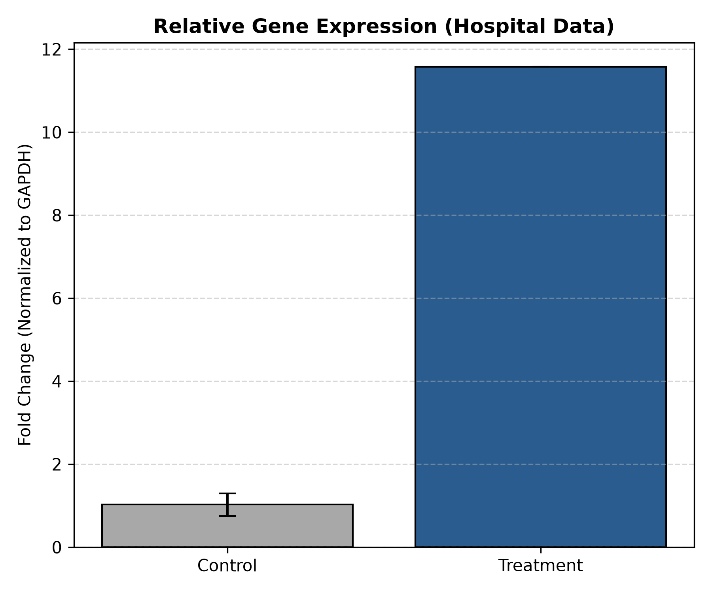

# Clinical qPCR Data Cleaning & Quantification Pipeline

A Python-based workflow designed to automate quality control (QC), outlier removal, and relative gene quantification ($2^{-\Delta\Delta C_t}$) from raw clinical assay data.

## Key Features
- **Data Standardization:** Parses European/Excel CSV outputs with semicolon separators and comma-decimal notations.
- **Automated Quality Control:** Filters out incomplete measurements (`NaN`) and non-specific amplification artifacts ($C_t > 35.0$).
- **Normalization:** Normalizes target gene expression against an internal reference control (*GAPDH*).
- **Visualization:** Generates publication-ready bar charts with standard deviation error bars (`matplotlib`).

## Output Example
The pipeline processes raw clinical data (`hospital.csv`) and automatically exports a normalized relative expression plot:



## Usage
1. Place raw exported qPCR data in `hospital.csv`.
2. Execute the pipeline:
   ```bash
   python3 qpcr_analysis.py# qpcr-delta-delta-ct-analysis
Small Python script for cleaning raw qPCR Ct values and calculating relative fold change
